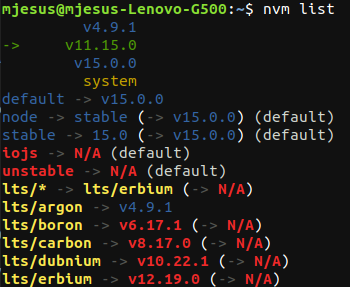
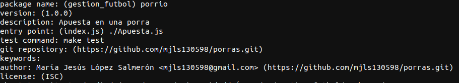
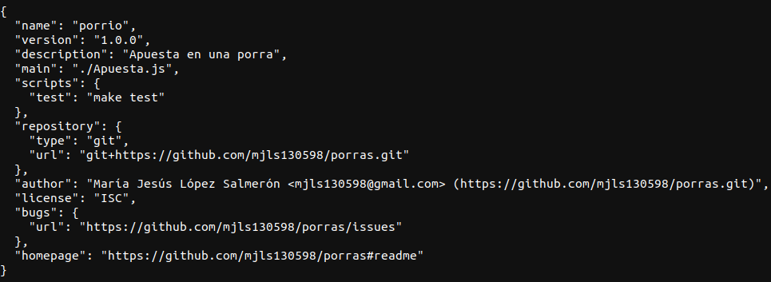
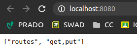
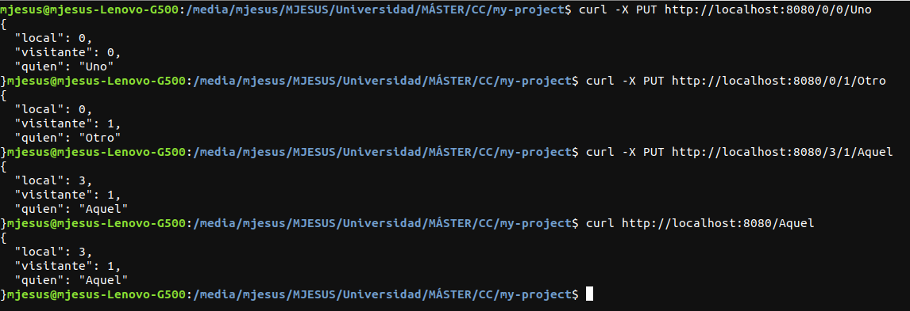
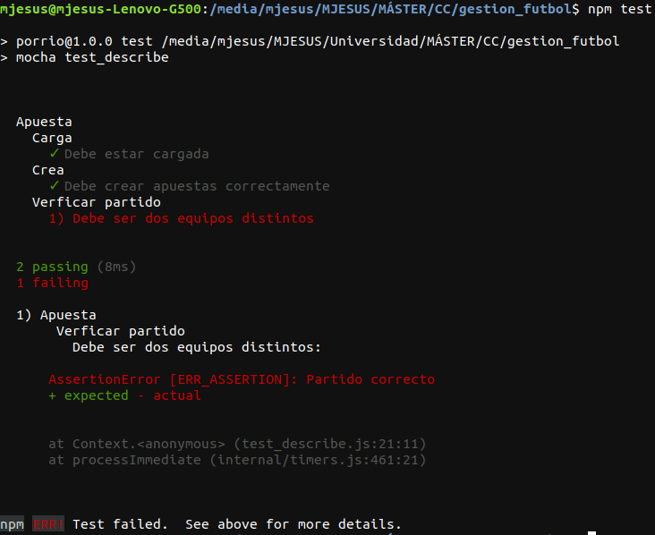
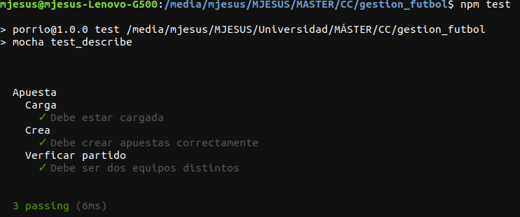
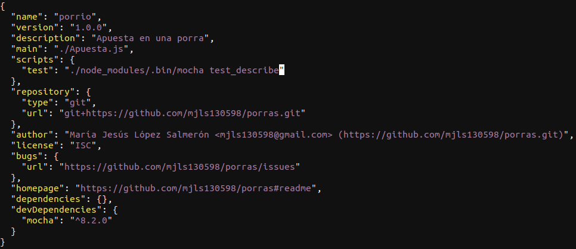

# Ejercicios del tema 2

## Ejercicio 1. Instalar alguno de los entornos virtuales de node.js (o de cualquier otro lenguaje con el que se esté familiarizado) y, con ellos, instalar la última versión existente, la versión minor más actual de la 4.x y lo mismo para la 0.11 o alguna impar (de desarrollo).

Las distintas versiones que se han instalado para este ejercicio son del lenguaje *node.js* con el entorno virtual *nvm*.

Para instalar las versiones, primero he instalado el entorno virtual nvm escribiendo en la terminal el siguiente comando:

`curl -o- https://raw.githubusercontent.com/nvm-sh/nvm/v0.36.0/install.sh | bash`

Una vez instalado, se comenzó a instalar las distintas versiones escribiendo en la terminal

`nvm install v8.11.1`

siendo `8.11.1` la versión que se quiere descargar.

Para ver las versiones disponibles que se pueden instalar se ejecuta en la terminal el comando

`nvm ls-remote`

Las versiones instaladas fueron la 15.0.0, la 4.9.1 y la 11.15.0.

Una demostración de que se ha realizado la instalación de las versiones anteriores se encuentra en la siguiente imagen:



## Ejercicio 2. Crear una descripción del módulo usando package.json. En caso de que se trate de otro lenguaje, usar el método correspondiente.

Para crear la descripción del módulo de la aplicación de ejemplo, se debe escribir en la terminal dentro de la carpeta del proyecto `npm init`. Una vez ejecutado el comando anterior, se deberán seguir los pasos que se indica por pantalla como los de la siguiente imagen:



Cuando se hayan realizado todos los pasos, el *package.json* resultado es el que se muestra a continuación:



## Ejercicio 3. Descargar el repositorio de ejemplo anterior, instalar las herramientas necesarias (principalmente Scala y sbt) y ejecutar el ejemplo desde sbt. Alternativamente, buscar otros marcos para REST en Scala tales como Finatra o Scalatra y probar los ejemplos que se incluyan en el repositorio.

Primero, se instaló *Java 8*, *Scala* y *SBT*. Los pasos que se siguió para instalar *SBT* se encuentra en [su página oficial](https://www.scala-sbt.org/download.html?_ga=2.121828747.1077410046.1603361923-1348640796.1603358470).

Una vez instaladas las herramientas necesarias, se clonó el repositorio del profesor con `git clone https://github.com/JJ/spray-test my-project`.

Cuando se terminó de clonar el repositorio "spray-test", se ejecutó en el terminal dentro del directorio el comando `sbt`, que cargará el proyecto y nos mostrará un shell donde se escribe las órdenes que se quieran ejecutar sobre ese proyecto.

A continuación, se ejecutaron los test sobre este proyecto con la orden `test`. El resultado de que el test se pasó correctametne se muestra en la siguiente imagen:


Después, se escribió en el shell `re-start` para que comenzara la aplicación. Cuando se esté ejecutando el comando anterior, se dirigió a http://localhost:8080 como se muestra a continuación:



En una terminal distinta, se ejecuta una serie de pruebas para ver el correcto funcionamiento del proyecto. Las pruebas que se realizaron se pueden observar en la siguiente imagen:



Para terminar la ejecución del proyecto, se escribe en el shell de *SBT* `re-stop`.

## Ejercicio 4. Para la aplicación que se está haciendo, escribir una serie de aserciones y probar que efectivamente no fallan. Añadir tests para una nueva funcionalidad, probar que falla y escribir el código para que no lo haga. A continuación, ejecutarlos desde mocha (u otro módulo de test de alto nivel), usando descripciones del test y del grupo de test de forma correcta. Si hasta ahora no has subido el código que has venido realizando a GitHub, es el momento de hacerlo, porque lo vamos a necesitar un poco más adelante.

Antes de crear los test, se ha creado el archivo *Apuesta.js* con cinco funciones:

1. Para que recoja los datos
2. Para que escriba dichos datos en un string.
3. Para que devuelva el valor de local.
4. Para que devuelva el valor de visitante.
5. Para que devuelva el valor del resultado.

Dicho archivo se observa a continuación:

```
exports.Apuesta = function(local, visitante, resultado){
        this.local = local;
        this.visitante = visitante;
        this.resultado = resultado;

        this.as_string = as_string;
        this.ver_local = ver_local;
        this.ver_visitante = ver_visitante;
        this.ver_resultado = ver_resultado;
}

function as_string(){
        return this.local + ": " + this.visitante + " - " + this.resultado;
}

function ver_local(){
        return this.local;
}

function ver_visitante(){
        return this.visitante;
}

function ver_resultado(){
        return this.resultado;
}
```

A continuación, se creó el fichero, cuyo nombre es *test.js*, que se encarga de ejecutar los test sobre *Apuesta.js*. En él se realiza varias comprobaciones:

1. La apuesta creada y la apuesta escrita en una cadena sean iguales.
2. El equipo local y el equipo visitante sean distintos.
3. El resultado de la apuesta sea igual que el escrito en una cadena.

El archivo comentado anteriormente se muestra a continuación:

```
var apuesta = require("./Apuesta.js"),
assert= require("assert");

var nueva_apuesta = new apuesta.Apuesta('Polopos','Alhama','2-3');
assert(nueva_apuesta, "Creada apuesta");
assert.equal(nueva_apuesta.as_string(), "Polopos: Alhama - 2-3","Creado");
assert.notEqual(nueva_apuesta.ver_local(), nueva_apuesta.ver_visitante(), "Partido correcto");
assert.equal(nueva_apuesta.ver_resultado(), "2-3", "Resultado correcto");
console.log("Si has llegado aquí, han pasado todos los tests");
```

Después, se creó otro archivo de test llamado *test_describe.js* con los que se ejecutará con el módulo de test *mocha*. Este test verifica que se haya cargado la biblioteca correctamente, que se haya creado una apuesta y que los datos del partido sean correctos.

Primero cometeremos el error de crear una apuesta cuyo equipo visitante es igual que el equipo local, como se muestra en el siguiente código:

```
var assert = require("assert"),
      apuesta = require("./Apuesta.js");

describe('Apuesta', function(){          
        describe('Carga', function(){           
                it('Debe estar cargada', function(){
                        assert(apuesta, "Cargado");
                });      
        });

        describe('Crea', function(){            
                it('Debe crear apuestas correctamente', function(){
                        var nueva_apuesta = new apuesta.Apuesta('Polopos','Alhama','2-3');
                        assert.equal(nueva_apuesta.as_string(), "Polopos: Alhama - 2-3","Creado");
                });     
        });

        describe('Verficar partido', function(){
                it('Debe ser dos equipos distintos', function(){
                        var nueva_apuesta = new apuesta.Apuesta('Polopos','Polopos', '2-3');
                        assert.notEqual(nueva_apuesta.ver_local(),nueva_apuesta.ver_visitante(), "Partido correcto");
                });
        });
});
```
Si se ejecuta dicho test con *mocha* escribiendo en la terminal `mocha test_describe.js`, sucederá lo que se muestra a continuación:



Se arregla dicho error y quedaría como el siguiente código:

```
var assert = require("assert"),
      apuesta = require("./Apuesta.js");

describe('Apuesta', function(){
        describe('Carga', function(){
                it('Debe estar cargada', function(){
                        assert(apuesta, "Cargado");
                });
        });

        describe('Crea', function(){
                it('Debe crear apuestas correctamente', function(){
                        var nueva_apuesta = new apuesta.Apuesta('Polopos','Alhama','2-3');
                        assert.equal(nueva_apuesta.as_string(), "Polopos: Alhama - 2-3","Creado");
                });
        });

        describe('Verficar partido', function(){
                it('Debe ser dos equipos distintos', function(){
                        var nueva_apuesta = new apuesta.Apuesta('Polopos','Alhama', '2-3');
                        assert.notEqual(nueva_apuesta.ver_local(),nueva_apuesta.ver_visitante(), "Partido correcto");
                });
        });
});
```

Cuya salida del test una vez ejecutado sería de la siguiente manera:



Para ejecutar este archivo, previamente se ha descargado mocha en nuestro proyecto escribiendo en la terminal `npm install mocha --save-dev`, que se incluirá como *devDependencies* en el archivo *package.json*. Además, para que se ejecutara el test con `npm test`, se cambió el valor del atributo *test* de *package.json* por *./node_modules/.bin/mocha test_describe.js*. El resultado de los cambios anteriores sería el siguiente:



## Ejercicio 5.
## 1. Darse de alta. Muchos están conectados con GitHub por lo que puedes usar directamente el usuario ahí. A través de un proceso de autorización, acceder al contenido e incluso informar del resultado de los tests.

## 2. Activar el repositorio en el que se vaya a aplicar la integración continua. Travis permite hacerlo directamente desde tu configuración; en otros se dan de alta desde la web de GitHub.

## 3. Crear un fichero de configuración para que se ejecute la integración y añadirlo al repositorio.

El sistema que se va a instalar en nuestro repositorio en Github es *Travis*. Los pasos que se han realizado para la activación de travis en el repositorio de las apuestas de fútbol se han sacado de la [página EGC de la Universidad de Sevilla](https://1984.lsi.us.es/wiki-egc/index.php/Primeros_pasos_con_Travis_CI#:~:text=Para%20empezar%20con%20Travis%20CI,-Haz%20un%20fork&text=Usando%20tu%20cuenta%20de%20GitHub,confirmaci%C3%B3n%20de%20permisos%20de%20GitHub.&text=Comprueba%20en%20la%20p%C3%A1gina%20de,para%20que%20falle%20una%20prueba.)

Primero, se loguea en *Travis CI* con la cuenta de GitHub y, cuando se haya logueado correctamente y se hayan sincronizado los repositorios de Github, se activa *Travis CI* en el repositorio donde se quiera construir dentro de la página de *Travis CI*.


Por último, se crea el fichero *.travis.yml* en la raíz del directorio y se escribe el lenguaje en el que está el proyecto, en mi caso contiene lo siguiente:

```
language: node_js
node_js:
	- "14.14.0"

before_script: chmod 0777 ./node_modules/.bin/mocha
```

La última línea fue insertada dentro del archivo porque cuando ejecutaba *Travis CI* la parte de los test tenía problemas con los permisos de acceso a los archivos de *mocha*. Esta solución fue encontrada en la página de [*Sharma*](http://sharmac1odewiki.blogspot.com/2012/08/nodejs-permission-denied-when-running.html).
