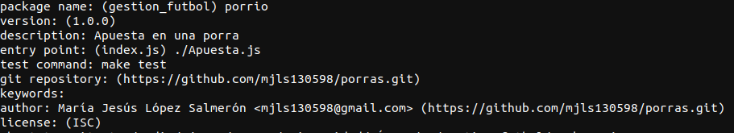
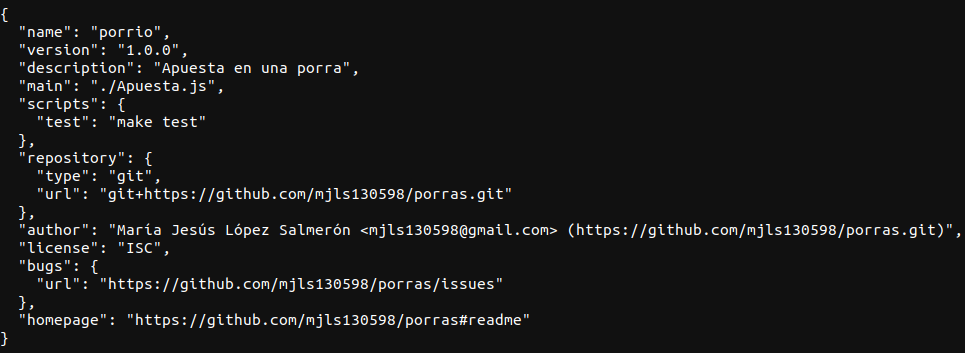
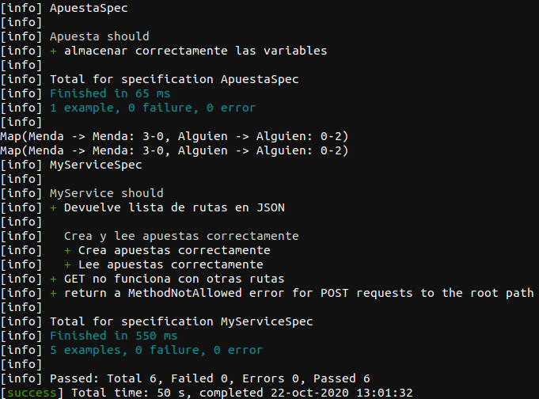
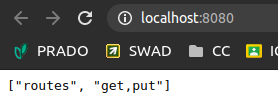
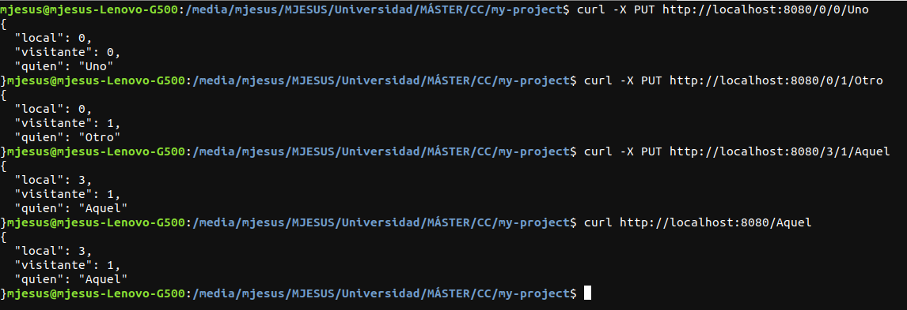

# Ejercicios del tema 2

## Ejercicio 1. Instalar alguno de los entornos virtuales de node.js (o de cualquier otro lenguaje con el que se esté familiarizado) y, con ellos, instalar la última versión existente, la versión minor más actual de la 4.x y lo mismo para la 0.11 o alguna impar (de desarrollo).

Las distintas versiones que se han instalado para este ejercicio son del lenguaje node.js con el entorno virtual nvm.

Para instalar las versiones, primero he instalado el entorno virtual nvm escribiendo en la terminal el siguiente comando:

`curl -o- https://raw.githubusercontent.com/nvm-sh/nvm/v0.36.0/install.sh | bash`

Una vez instalado, se comenzó a instalar las distintas versiones escribiendo en la terminal 

`nvm install v8.11.1`

siendo `8.11.1` la versión que se quiere descargar.

Para ver las versiones disponibles que se pueden instalar se ejecuta en la terminal el comando

`nvm ls-remote`

Las versiones instaladas fueron la 15.0.0, la 4.9.1 y la 11.15.0.

Una demostración de que se ha realizado la instalación de las versiones anteriores se encuentra en la siguiente imagen:

## Ejercicio 2. Crear una descripción del módulo usando package.json. En caso de que se trate de otro lenguaje, usar el método correspondiente.

Para crear la descripción del módulo de la aplicación de ejemplo, se debe escribir en la terminal dentro de la carpeta del proyecto `npm init`. Una vez ejecutado el comando anterior, se deberán seguir los pasos que se indica por pantalla como los de la siguiente imagen:

Cuando se hayan realizado todos los pasos, el package.json resultado es el que se muestra a continuación:

## Ejercicio 3. Descargar el repositorio de ejemplo anterior, instalar las herramientas necesarias (principalmente Scala y sbt) y ejecutar el ejemplo desde sbt. Alternativamente, buscar otros marcos para REST en Scala tales como Finatra o Scalatra y probar los ejemplos que se incluyan en el repositorio.

Primero, se instaló Java 8, Scala y SBT. Los pasos que se siguió para instalar SBT se encuentra en [su página oficial](https://www.scala-sbt.org/download.html?_ga=2.121828747.1077410046.1603361923-1348640796.1603358470).

Una vez instaladas las herramientas necesarias, se clonó el repositorio del profesor con `git clone https://github.com/JJ/spray-test my-project`.

Cuando se terminó de clonar el repositorio "spray-test", se ejecutó en el terminal dentro del directorio el comando `sbt`, que cargará el proyecto y nos mostrará un shell donde se escribe las órdenes que se quieran ejecutar sobre ese proyecto.

A continuación, se ejecutaron los test sobre este proyecto con la orden `test`. El resultado de que el test se pasó correctametne se muestra en la siguiente imagen:

Después, se escribió en el shell `re-start` para que comenzara la aplicación. Cuando se esté ejecutando el comando anterior, se dirigió a http://localhost:8080 como se muestra a continuación:

En una terminal distinta, se ejecuta una serie de pruebas para ver el correcto funcionamiento del proyecto. Las pruebas que se realizaron se pueden observar en la siguiente imagen:

Para terminar la ejecución del proyecto, se escribe en el shell de SBT `re-stop`.

