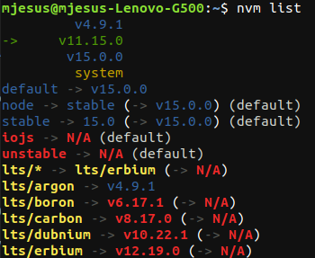

# Ejercicios del tema 2

## Ejercicio 1. Instalar alguno de los entornos virtuales de node.js (o de cualquier otro lenguaje con el que se esté familiarizado) y, con ellos, instalar la última versión existente, la versión minor más actual de la 4.x y lo mismo para la 0.11 o alguna impar (de desarrollo).

Las distintas versiones que se han instalado para este ejercicio son del lenguaje node.js con el entorno virtual nvm.

Para instalar las versiones, primero he instalado el entorno virtual nvm escribiendo en la terminal el siguiente comando:

`curl -o- https://raw.githubusercontent.com/nvm-sh/nvm/v0.36.0/install.sh | bash`

Una vez instalado, se comenzó a instalar las distintas versiones escribiendo en la terminal 

`nvm install v8.11.1`

siendo `8.11.1` la versión que se quiere descargar.

Para ver las versiones disponibles que se pueden instalar se ejecuta en la terminal el comando

`nvm ls-remote`

Las versiones instaladas fueron la 15.0.0, la 4.9.1 y la 11.15.0.

Una demostración de que se ha realizado la instalación de las versiones anteriores se encuentra en la siguiente imagen:

## Ejercicio 2. Crear una descripción del módulo usando package.json. En caso de que se trate de otro lenguaje, usar el método correspondiente.

`{
  "author": "María Jesús López Salmerón <mjls130598@gmail.com> (https://github.com/mjls130598/sharingnotes),
  "name": "SharingNotes",
  "description":"Repositorio de apuntes",
  "version":"0.0.1",
  "repository":{
    "url":"https://github.com/mjls130598/sharingnotes"
  },
  "main":"./main.js",
  "scripts":{
    "test":"make test"
  },
  "dependencies":{"mysql":"~2.0.0"},
  "devDependencies":{},
  "optionalDependencies":{},
  "engines":{
    "node":">=1.2.0"
  }
 }`

 
