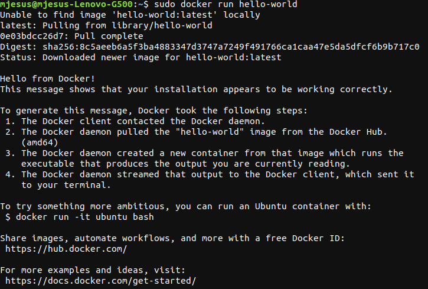
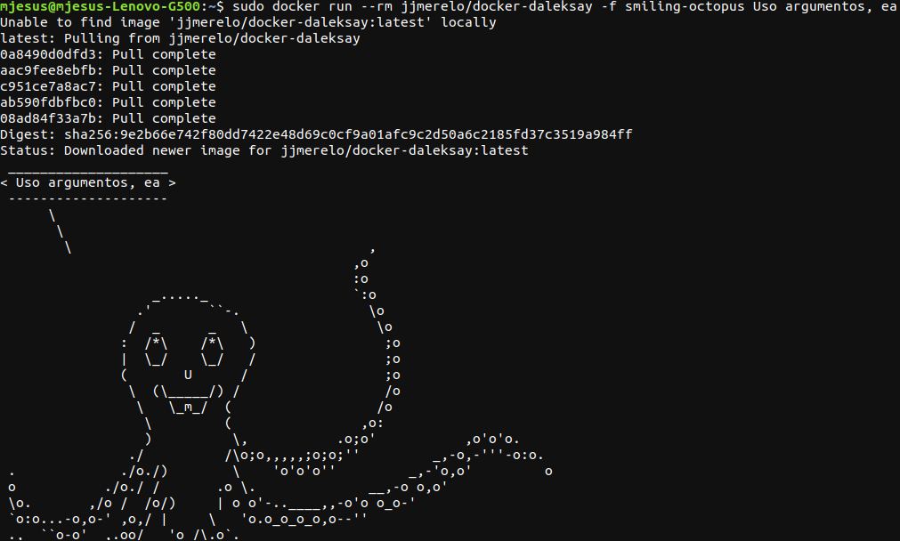
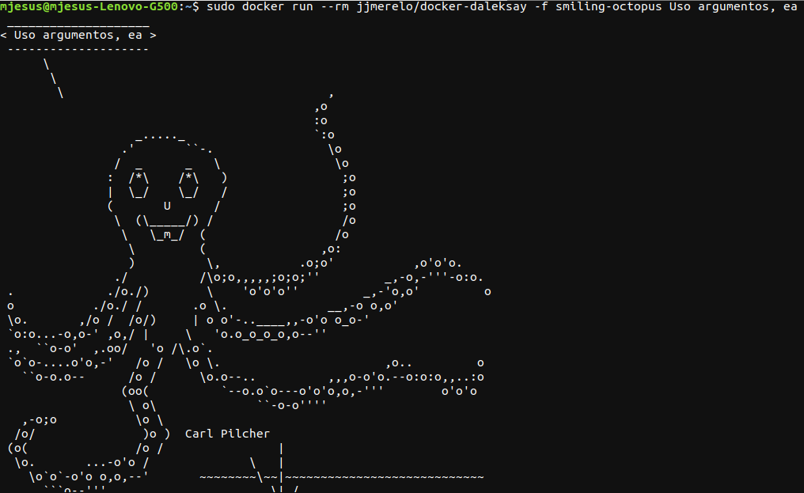
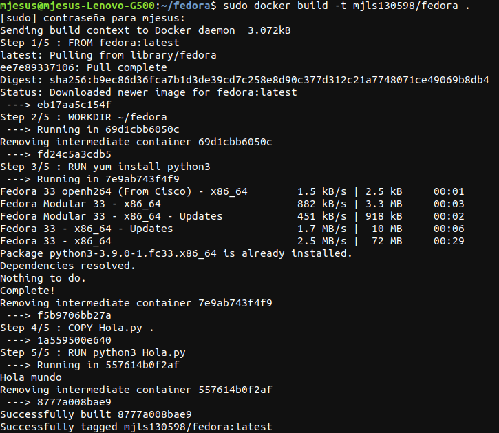
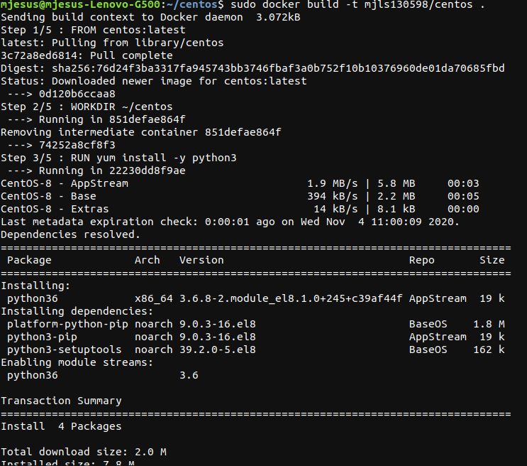
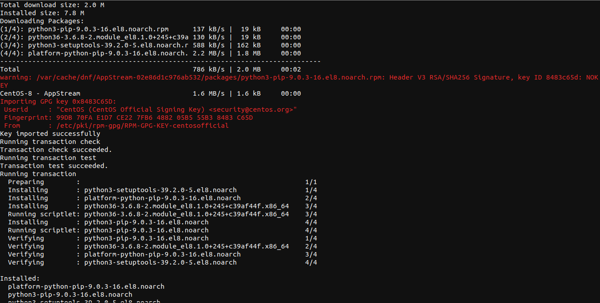
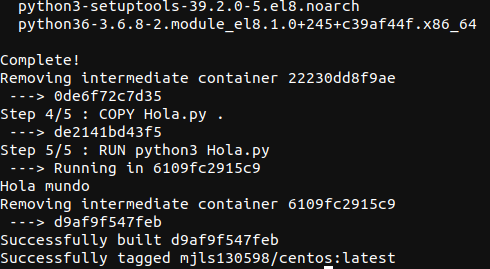
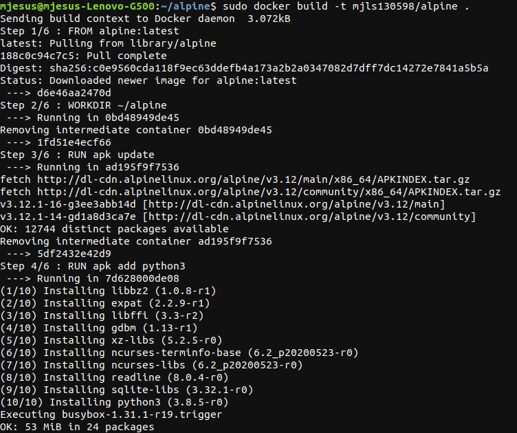
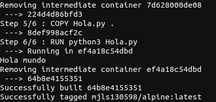
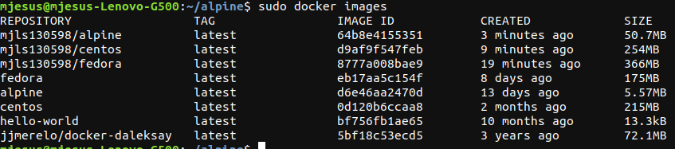

# Ejercicios del tema 3

## Ejercicio 1. Buscar alguna demo interesante de Docker y ejecutarla localmente, o en su defecto, ejecutar la imagen anterior y ver cómo funciona y los procesos que se llevan a cabo la primera vez que se ejecuta y las siguientes ocasiones.

Antes de buscar alguna demo y descargar la imagen se debe haber descargado *Docker* en el dispositivo.

Para descargar *Docker* abrimos una terminal y escribios los siguientes pasos:

1. Se actualiza el paquete apt con `sudo apt-get update`.
2. Se instalan los paquetes necesarios para utilizar *Docker* con el comando `sudo apt-get install docker-ce docker-ce-cli containerd.io`
3. Se verifica que se ha instalado correctamente ejecutando la orden `sudo docker run hello-world`

La siguiente imagen se muestra la primera descarga de la imagen *hello-world*.



Los pasos seguidos se han obtenido de la [página oficial de *Docker*](https://docs.docker.com/engine/install/ubuntu/).

A continuación, se va a descargar el contenedor *jjmerelo/daleksay*, para eso se ejecuta el comando `sudo docker run --rm jjmerelo/docker-daleksay -f smiling-octopus Uso argumentos, ea` que realiza lo que se muestra en la siguiente imagen y que borra el contenedor que se haya creado para instalar la imagen una vez creada.



La primera vez que se ejecuta la imagen se descarga aquello necesario para instalar la imagen. En las siguientes veces que se ejecuta la imagen, ya no se vuelve a descargar los procesos necesarios para su ejecución como se muestra a continuación:



## Ejercicio 2. Tomar algún programa simple, “Hola mundo” impreso desde el intérprete de línea de órdenes, y comparar el tamaño de las imágenes de diferentes sistemas operativos base, Fedora, CentOS y Alpine, por ejemplo.

Para descargar cada una de las diferentes imágenes se han hecho distintos *Dockerfiles* donde se detalla la imagen que se va a usar, el directorio de trabajo, el fichero que va a copiar del dispositivo local, lo que tiene que instalar dentro de la imagen para ejecutar el fichero anterior y la ejecución del fichero importado. Para ejecutar los *Dockerfiles* creados se escribirá en la terminal donde se encuentre el archivo *Dockerfile* correspondiente `sudo docker build -t mjls130598/fedora .`, siendo *fedora* la imagen que se va a instalar.

Primero se realizará sobre la imagen *Fedora*. El *Dockerfile* de esta imagen se observa a cotinuación:

```
FROM fedora:latest

WORKDIR ~/fedora

RUN yum install python3

COPY Hola.py .

RUN python3 Hola.py
```

La imagen que se muestra a continuación es el resultado de ejecutar el anterior *Dockerfile*:



Ahora se realizará lo mismo que en Fedora, pero esta vez con el sistema operativo *CentOS*:

```
FROM centos:latest

WORKDIR ~/centos

RUN yum install -y python3

COPY Hola.py .

RUN python3 Hola.py
```
El resultado de construir la imagen gracias a ese *Dockerfile* se muestran en las siguientes imágenes:





Por último, se realizará una imagen con el sistema operativo *Alpine* con el siguiente *Dockerfile*:

```
FROM alpine:latest

WORKDIR ~/alpine

RUN apk update

RUN apk add python3

COPY Hola.py .

RUN python3 Hola.py
```

El resultado obtenido de ejecutar el *Dockerfile* anterior se observa en las siguientes imágenes:




La información necesaria para crear los *Dockerfiles* se ha obtenido de la página [*Colaboratorio*](https://colaboratorio.net/davidochobits/sysadmin/2018/crear-imagenes-medida-docker-dockerfile/), [*Pledin 3.0*](https://www.josedomingo.org/pledin/2016/02/ejemplos-de-ficheros-dockerfile-creando-imagenes-docker/), [*Takacsmark*](https://takacsmark.com/dockerfile-tutorial-by-example-dockerfile-best-practices-2018/) y la [oficial de *Docker*](https://takacsmark.com/dockerfile-tutorial-by-example-dockerfile-best-practices-2018/)

Por último, se va a ver el espacio que ocupa cada imagen. Para ello se ejecutará la orden `sudo docker images` cuyo resultado se muestra en la siguiente foto. Como se puede observar, *Alpine* es el que ocupa menos espacio tanto la que contiene solamente la imagen como aquella que tiene todo instalado para ejecutar el fichero importado, mientras que la imagen con solamente *CentOS* es la que ocupa más aunque la que utiliza *Fedora* con todo lo necesario para ejecutar el archivo local es la que más ocupa.



## Ejercicio 3. Crear a partir del contenedor anterior una imagen persistente con commit.
