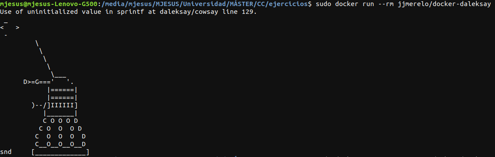

# Ejercicios del tema 3

## Ejercicio 1. Buscar alguna demo interesante de Docker y ejecutarla localmente, o en su defecto, ejecutar la imagen anterior y ver cómo funciona y los procesos que se llevan a cabo la primera vez que se ejecuta y las siguientes ocasiones.

Antes de ejecutar cualquier demo se debe instalar *Docker* en el ordenador. En mi caso, tiene como sistema operativo *Ubuntu 18.04*, por lo que no es complicada la instalación en él.

Para instalar *Docker* hay que abrir una terminal y ejecutar el comando `sudo apt-get install docker-ce docker-ce-cli containerd.io`. Después, comprobar que se ha instalado correctamente ejecutando `sudo docker run hello-world` (debe salir como resultado la siguiente imagen).

Los pasos para obtener *Docker* se obtuvieron de su [página oficial](https://docs.docker.com/engine/install/ubuntu/#install-docker-engine)

Una vez instalado correctamente *Docker*, pasamos a ejecutar una imagen. Para ejecutar una imagen se escribe en la terminal `sudo docker run`. A continuación, se muestra la imagen correspondientes a una ejecución del comando anterior.

## Ejercicio 2. Tomar algún programa simple, “Hola mundo” impreso desde el intérprete de línea de órdenes, y comparar el tamaño de las imágenes de diferentes sistemas operativos base, Fedora, CentOS y Alpine, por ejemplo.

