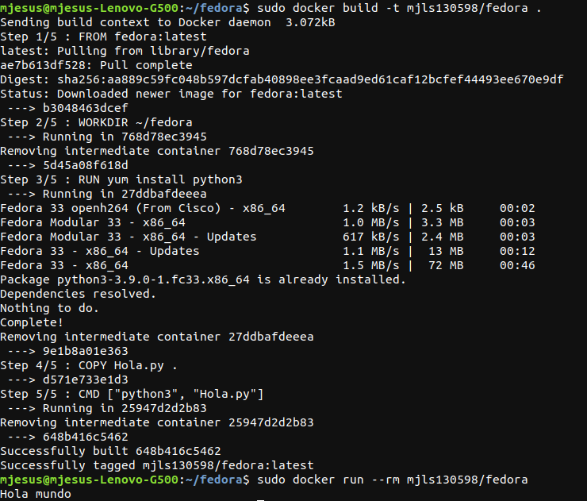
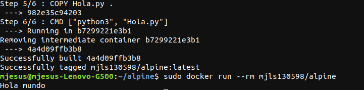

# Ejercicios del tema 3

## Ejercicio 1. Buscar alguna demo interesante de Docker y ejecutarla localmente, o en su defecto, ejecutar la imagen anterior y ver cómo funciona y los procesos que se llevan a cabo la primera vez que se ejecuta y las siguientes ocasiones.

Antes de buscar alguna demo y descargar la imagen se debe haber descargado *Docker* en el dispositivo.

Para descargar *Docker* abrimos una terminal y escribios los siguientes pasos:

1. Se actualiza el paquete apt con `sudo apt-get update`.
2. Se instalan los paquetes necesarios para utilizar *Docker* con el comando `sudo apt-get install docker-ce docker-ce-cli containerd.io`
3. Se verifica que se ha instalado correctamente ejecutando la orden `sudo docker run hello-world`

La siguiente imagen se muestra la primera descarga de la imagen *hello-world*.


Los pasos seguidos se han obtenido de la [página oficial de *Docker*](https://docs.docker.com/engine/install/ubuntu/).

A continuación, se va a descargar el contenedor *jjmerelo/daleksay*, para eso se ejecuta el comando `sudo docker run --rm jjmerelo/docker-daleksay -f smiling-octopus Uso argumentos, ea` que realiza lo que se muestra en la siguiente imagen y que borra el contenedor que se haya creado para instalar la imagen una vez creada.


La primera vez que se ejecuta la imagen se descarga aquello necesario para instalar la imagen. En las siguientes veces que se ejecuta la imagen, ya no se vuelve a descargar los procesos necesarios para su ejecución como se muestra a continuación:


## Ejercicio 2. Tomar algún programa simple, “Hola mundo” impreso desde el intérprete de línea de órdenes, y comparar el tamaño de las imágenes de diferentes sistemas operativos base, Fedora, CentOS y Alpine, por ejemplo.

Para descargar cada una de las diferentes imágenes se han hecho distintos *Dockerfiles* donde se detalla la imagen que se va a usar, el directorio de trabajo, el fichero que va a copiar del dispositivo local, lo que tiene que instalar dentro de la imagen para ejecutar el fichero anterior y la ejecución del fichero importado. Para ejecutar los *Dockerfiles* creados se escribirá en la terminal donde se encuentre el archivo *Dockerfile* correspondiente `sudo docker build -t mjls130598/fedora .` para crear la imagen y, a continuación, `sudo docker run --rm mjls130598/fedora`, siendo *fedora* la imagen que se va a instalar.

Primero se realizará sobre la imagen *Fedora*. El *Dockerfile* de esta imagen se observa a cotinuación:

```
FROM fedora:latest

WORKDIR ~/fedora

RUN yum install python3

COPY Hola.py .

CMD ["python3", "Hola.py"]
```

La imagen que se muestra a continuación es el resultado de ejecutar el anterior *Dockerfile*:



Ahora se realizará lo mismo que en Fedora, pero esta vez con el sistema operativo *CentOS*:

```
FROM centos:latest

WORKDIR ~/centos

RUN yum install -y python3

COPY Hola.py .

CMD ["python3", "Hola.py"]
```
El resultado de construir la imagen gracias a ese *Dockerfile* se muestran en las siguientes imágenes:


Por último, se realizará una imagen con el sistema operativo *Alpine* con el siguiente *Dockerfile*:

```
FROM alpine:latest

WORKDIR ~/alpine

RUN apk update

RUN apk add python3

COPY Hola.py .

CMD ["python3", "Hola.py"]
```

El resultado obtenido de ejecutar el *Dockerfile* anterior se observa en las siguientes imágenes:




La información necesaria para crear los *Dockerfiles* se ha obtenido de la página [*Colaboratorio*](https://colaboratorio.net/davidochobits/sysadmin/2018/crear-imagenes-medida-docker-dockerfile/), [*Pledin 3.0*](https://www.josedomingo.org/pledin/2016/02/ejemplos-de-ficheros-dockerfile-creando-imagenes-docker/), [*Takacsmark*](https://takacsmark.com/dockerfile-tutorial-by-example-dockerfile-best-practices-2018/) y la [oficial de *Docker*](https://docs.docker.com/get-started/part2/#sample-dockerfile).

Por último, para ver el espacio que ocupa cada una de las imágenes anteriores se ejecuta la orden `sudo docker images` cuyo resultado se muestra en la siguiente foto.


Como se puede observar, *Alpine* es el que ocupa menos espacio tanto la que contiene solamente la imagen como aquella que tiene todo instalado para ejecutar el fichero importado, mientras que la imagen con solamente *CentOS* es la que ocupa más aunque la que utiliza *Fedora* con todo lo necesario para ejecutar el archivo local es la que más ocupa.

## Ejercicio 3. Crear a partir del contenedor anterior una imagen persistente con commit.

Para realizar el commit sobre un contenedor, primero debe haber un contenedor. Para que se cree un contenedor se debe ejecutar sobre una de las imágenes un comando parecido a `sudo docker run mjls130598/alpine` (siendo *mjls130598/alpine* una de las imágenes creadas, en concreto aquella creada para el ejercicio anterior).

Con la orden `sudo docker ps -l` vemos qué contenedores tenemos almacenados. Si se ha ejecutado previamente el comando del párrafo anterior,se muestra como resultado la siguiente foto.


A continuación, se crea la imagen persistente con `sudo docker commit f1128df6a613 nuevo-alpine` y, para comprobar que se ha realizado correctamente, se escribe en la terminal `sudo docker images`. El resultado del último comando es el siguiente:


## Ejercicio 4. Examinar la estructura de capas que se forma al crear imágenes nuevas a partir de contenedores que se hayan estado ejecutando.

Se va a examinar la estructura de capas de la imagen persistente creada en el ejercicio anterior (*nuevo-alpine*). Para ello se obtiene el SHA resultado del `sudo docker commit` realizado previemente y se escribe en la terminal `sudo jq '.' /var/lib/docker/image/overlay2/imagedb/content/sha256/0a1ace3a739409c06ed4187bdd5f8483dd895cc17621e2aeafe3773663bb159a`.

Del fichero que nos muestra como resultado de la anterior ejecución, nos muestra las capas que tiene en el elemento *diff_ids*. Las capas de la imagen que se está utilizando como ejemplo son:


## Ejercicio 5. Crear un volumen y usarlo, por ejemplo, para escribir la salida de un programa determinado.

Para crear un volumen sólo hace falta ejecutar en la terminal `sudo docker volume create volumen`, siendo *volumen* el nombre del nuevo volumen. Para ver que se ha creado correctamente debe aparecer en la lista que se muestra como resultado de `sudo docker volume ls`.

A continuación, para utilizar el volumen creado anteriormente se ejecuta en la terminal `sudo docker run -it --name contenedor1 -v /volumen fedora bash` y, dentro del *bash* del contenedor se escribe `ls >> /volumen/fichero.txt` para que escriba la salida del comando `ls` dentro de un fichero que se almacena en el volumen creado.

Para ver que se ha utilizado el volumen dentro del contenedor *contenedor1*, con la orden `sudo docker inspect contenedor1` se ve en el apartado *Mount* lo siguiente:


Por último, para ver que se ha guardado el fichero que se ha creado dentro del bash de la imagen se escribe en la terminal `sudo ls /var/lib/docker/volumes/a00ac4ab0f9c1c37662c429221a817bcdb8ee5ba75aeb44dc443c75626d0e6db/_data` (siendo *a00ac4ab0f9c1c37662c429221a817bcdb8ee5ba75aeb44dc443c75626d0e6db* el identificador de *contenedor1*) que debería salir como resultado *fichero.txt* y cuyo contenido debe ser el resultado de `ls` dentro de la imagen.


## Ejercicio 6. Reproducir los contenedores creados anteriormente usando un Dockerfile.

Los Dockerfiles creados para los contenedores referentes al ejercicio 1 son los siguientes:

* Fedora:
```
FROM fedora:latest

WORKDIR ~/fedora

RUN yum install python3

COPY Hola.py .

CMD ["python3", "Hola.py"]
```

* CentOS:
```
FROM centos:latest

WORKDIR ~/centos

RUN yum install -y python3

COPY Hola.py .

CMD ["python3", "Hola.py"]
```

* Alpine:
```
FROM alpine:latest

WORKDIR ~/alpine

RUN apk update

RUN apk add python3

COPY Hola.py .

CMD ["python3", "Hola.py"]
```

## Ejercicio 7. Usar un miniframework REST para crear un servicio web y introducirlo en un contenedor, y componerlo con un cliente REST que sea el que finalmente se ejecuta y sirve como “frontend”.
