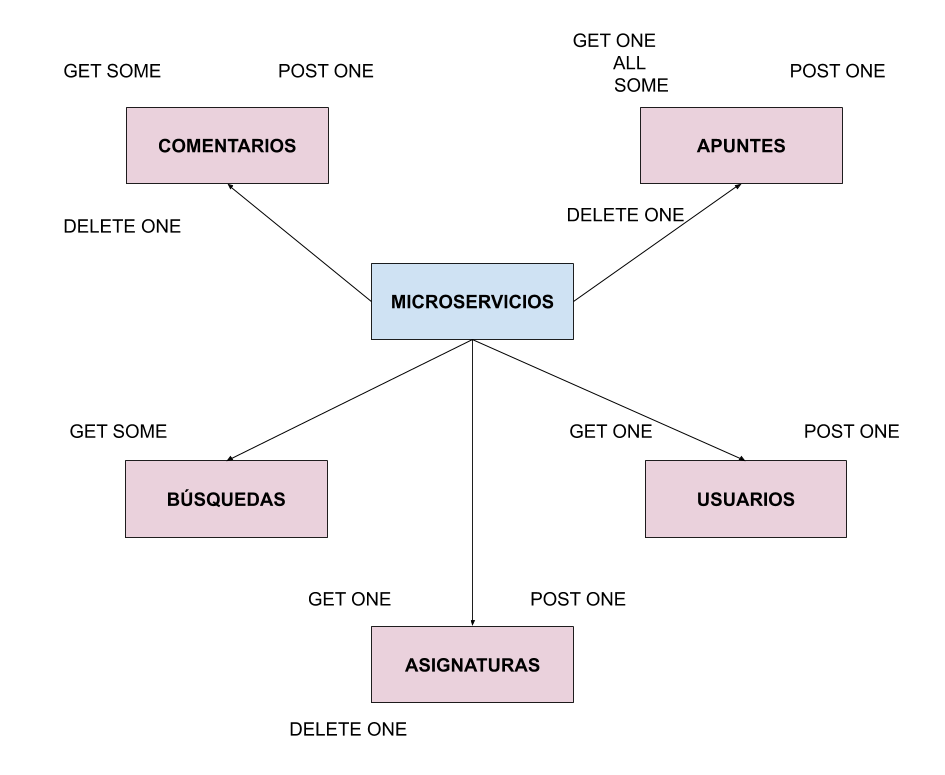

# Ejercicio del tema 5
## Ejercicio 1. Diseñar un API teniendo en cuenta las historias de usuario que se hayan hecho (u otras inventadas) teniendo en cuenta los principios y buenas prácticas que se han mostrado arriba.

En este caso se ha querido diseñar la API teniendo en cuenta las historias de usuario de mi proyecto, que se pueden ver en el siguiente [enlace](https://github.com/mjls130598/SharingNotes/labels/user-stories).

