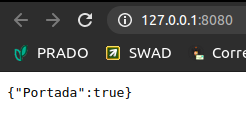
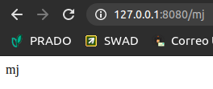
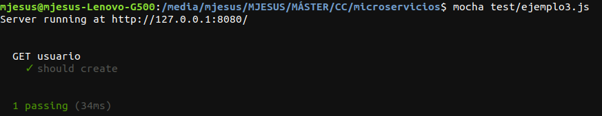
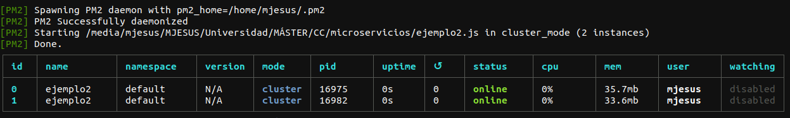
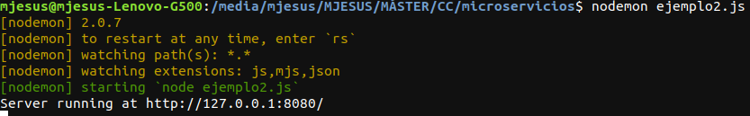
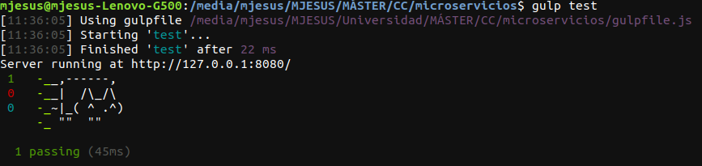

# Ejercicios del tema 6

## Ejercicio 1. Realizar una aplicación básica que use algún microframework para devolver alguna estructura de datos del modelo que se viene usando en el curso u otra que se desee. La intención de este ejercicio es simplemente que se vea el funcionamiento básico de un microframework, especialmente si es alguno que, como express, tiene un generador de código. Se puede usar, por otro lado, el lenguaje y microframework que se desee.

En el siguiente código en *node.js* se ve el microframework creado en el servidor local del ordenador. En él se puede ver que si se llama al elemento raíz del proyecto, devuelve un JSON cuyo valor es "{ Portada: true }", y si llama a "/proc" devuelve "{ Portada: false }".

```
#!/usr/bin/env node

var express=require('express');
var app = express();
var port = process.env.PORT || 8080;

app.get('/', function (req, res) {
    res.send( { Portada: true } );
});

app.get('/proc', function (req, res) {
    res.send( { Portada: false} );
});

app.listen(port);
console.log('Server running at http://127.0.0.1:'+port+'/');
```

En la siguiente imagen se puede ver el resultado de ejecutar el microframework y llamar a la raíz del proyecto:



## Ejercicio 2. Programar un microservicio en express (o el lenguaje y marco elegido) que incluya variables como en el caso anterior.

El siguiente código, escrito en *node.js*, lo que realiza es obtener el usuario que se manda a través de una variable en la URL.

```
#!/usr/bin/env node

var express=require('express');
var app = express();
var port = process.env.PORT || 8080;

app.get('/:usuario', function(request, response) {
    response.status(200).send( request.params.usuario );
});

app.listen(port);
console.log('Server running at http://127.0.0.1:'+port+'/');
module.exports = app;
```

Un ejemplo de la ejecución de este microservicio es la siguiente:



## Ejercicio 3. Crear pruebas para las diferentes rutas de la aplicación.

Para la realización de este ejercicio, se utiliza el código realizado para el ejercicio anterior.

Además, para poder testear las distintas rutas, se ha utilizado mocha, como se puede ver en el siguiente código:

```
var request = require('supertest'),
app = require('../ejemplo2.js');

describe( "GET usuario", function() {
    it('should create', function (done) {
       request(app)
           .get('/mj')
           .expect('Content-Type', "text/html; charset=utf-8")
           .expect(200,done);
    });
});
```

El resultado de ejecutar este test se muestra en la siguiente captura de pantalla:



## Ejercicio 4. Experimentar con diferentes gestores de procesos y servidores web front-end para un microservicio que se haya hecho con antelación, por ejemplo en la sección anterior.

Se han utilizado dos gestores de procesos para node distintos, *pm2* y *nodemon*. En la primera imagen se puede ver el resultado de utilizar *pm2* y en la última *nodemon*.





## Ejercicio 5. Usar rake, invoke o la herramienta equivalente en tu lenguaje de programación para programar diferentes tareas que se puedan lanzar fácilmente desde la línea de órdenes un microservicio.

Se ha utilizado *gulp* para programar las distintas tareas, en este caso iniciar y parar el microservicio. El siguiente código se puede ver las tareas realizadas en *node.js*.

```
const gulp  = require('gulp');
const mocha = require('gulp-mocha');
const pm2   = require('pm2');
var shell = require('gulp-shell');

gulp.task('test', async () => {
  gulp.src('test/ejemplo3.js', {read: false})
  .pipe(mocha({reporter: 'nyan'}))
});

gulp.task('start', async () => {
  pm2.connect(true, async () => {
    pm2.start({
      name: 'Ejercicio',
      script: './ejemplo2.js',
      exec_mode: 'cluster',
      instances: 4
    }, async () => {
         console.log('Arranca ejemplo');
       });
  });
});

gulp.task('stop', async () => {
  pm2.connect(true, async () => {
    pm2.stop( "Ejercicio", async ( err, proc ) => {
      pm2.disconnect();
      console.log("Parando ejemplo");
    });
  });
});
```

Como resultado del código anterior, se puede ver en la siguiente captura:

