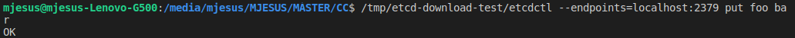
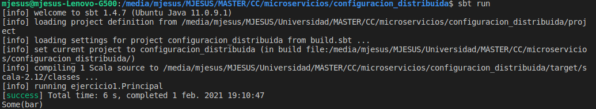
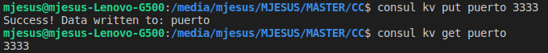

# Ejercicios del tema 7

## Ejercicio 1. Instalar etcd3, averiguar qué bibliotecas funcionan bien con el lenguaje que estemos escribiendo el proyecto (u otro lenguaje), y hacer un pequeño ejemplo de almacenamiento y recuperación de una clave; hacer el almacenamiento desde la línea de órdenes (con etcdctl) y la recuperación desde el mini-programa que hagáis.

En este caso, el lenguaje que se está utilizando para el proyecto de esta asignatura es *Scala*. 

Para la realización de este ejercicio se ha querido utilizar la biblioteca [*etcd4s*](https://github.com/mingchuno/etcd4s). Es un cliente de Scala etcd que implementa la API V3 usando gRPC y ScalaPB con soporte opcional Akka Stream.

En la siguiente imagen se puede ver cómo se ha guardado la clave a través de la terminal.



A continuación, se muestra el código utilizado para ver la clave. La información para su ejecución ha sido sacada del README de la dirección de la biblioteca seleccionada.

**build.sbt**

```
name := "configuracion_distribuida"
scalaVersion := "2.12.12"

libraryDependencies += "com.github.mingchuno" %% "etcd4s-core" % "0.4.0"
libraryDependencies += "com.github.mingchuno" %% "etcd4s-akka-stream" % "0.4.0"
```

**ejercicio1.scala**
```
package ejercicio1

import org.etcd4s.{Etcd4sClientConfig, Etcd4sClient}
import org.etcd4s.implicits._
import org.etcd4s.formats._
import org.etcd4s.pb.etcdserverpb._

import scala.concurrent.ExecutionContext.Implicits.global

object Principal{

  def main(args: Array[String]): Unit = {

    val config = Etcd4sClientConfig(
    address = "127.0.0.1",
    port = 2379
    )
    val client = Etcd4sClient.newClient(config) 

    client.getKey("foo").foreach { result =>
    println(result)
    }
  }
}
```

Como resultado de la ejecución dle proyecto anterior, se tiene como salida la siguiente captura de pantalla:



## Ejercicio 2. Instalar consul, averiguar qué bibliotecas funcionan bien con el lenguaje que estemos escribiendo el proyecto (u otro lenguaje), y hacer un pequeño ejemplo de almacenamiento y recuperación de una clave desde la línea de órdenes.

La siguiente captura de pantalla se puede ver el resultado de almacenar y obtener una clave con consul a través de la terminal.

