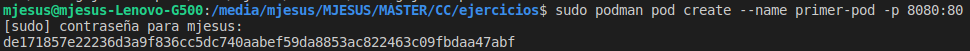
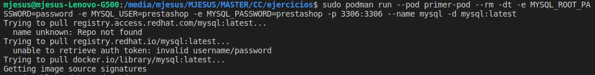
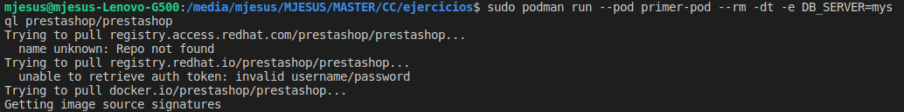
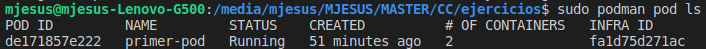
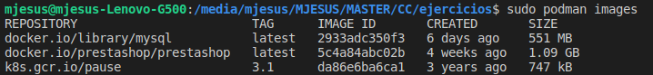
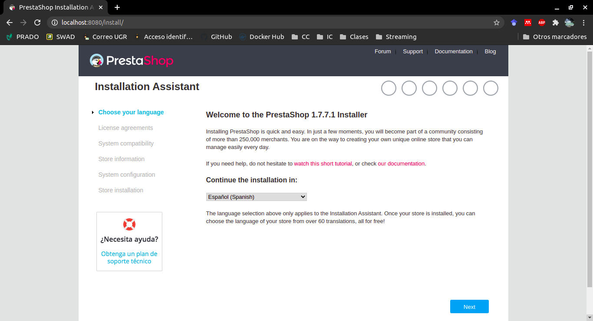

# Ejercicios del tema 8

## Ejercicio 1. Crear un pod con dos o más contenedores, de forma que se pueda usar uno desde el otro. Uno de los contenedores contendrá la aplicación que queramos desplegar.

Una vez instalado *Podman* en el dispositivo siguiendo los pasos del [tutorial](https://developers.redhat.com/blog/2019/01/15/podman-managing-containers-pods/?intcmp=701f20000012ngPAAQ) dependiendo del sistema operativo. En este caso se ha fijado en el apartado de Ubuntu. 

A continuación creamos un pod con el siguiente comando, el cual se va a llamar *"primer-pod"* y se va a comunicar con el puerto 8080:

```
sudo podman pod create --name primer-pod -p 8080:80
```



Posteriormente, se van añadir dos contenedores, uno contiene la base de datos del programa con *MySQL* y el segundo contendrá el programa *PrestaShop*.

Para añadir el primer contenedor se debe introducir la sentencia que se muestra a continuación:

```
sudo podman run --pod primer-pod --rm -dt -e MYSQL_ROOT_PASSWORD=password -e MYSQL_USER=prestashop -e MYSQL_PASSWORD=prestashop -p 3306:3306 --name mysql -d mysql:latest
```



Por último, se añade el contenedor que guarda la aplicación *Prestashop* con un comando similar al anterior:

```
sudo podman run --pod primer-pod --rm -dt -e DB_SERVER=mysql prestashop/prestashop
```



En las siguientes capturas se puede ver que se ha creado el pod adecuadamente y que se han guardado dentro de *Podman* los contenedores utilizados:





Por último, se puede ver de que el pod se está ejecutando y que se pude comenzar a utilizar la aplicación en la parte del cliente. En la siguiente imagen podemos ver que es cuando realmente se configura *PrestaShop* para después instalarlo.



## Ejercicio 2. Usar un miniframework REST para crear un servicio web y introducirlo en un contenedor, y componerlo con un cliente REST que sea el que finalmente se ejecuta y sirve como “frontend”.

Para este ejercicio se va a crear un framework REST con *Django*, mientras que en la parte del servidor se utilizará el proyecto realizado para esta asignatura [*SharingNotes*](https://github.com/mjls130598/SharingNotes). En este ejercicio únicamente se visualizarán los apuntes que tiene guardados.

Una vez construida la aplicación en *Django*, se escribe el Dockerfile que va a ejecutar *Docker Compose* que es el siguiente:

```
FROM python:3
ENV PYTHONUNBUFFERED=1
WORKDIR /code
COPY requirements.txt /code/
RUN pip install -r requirements.txt 0.0.0.0:8000
COPY . /code/

CMD python manage.py runserver
```

El [*Dockerfile*](https://github.com/mjls130598/SharingNotes/blob/master/Dockerfile) de *SharingNotes* es el mismo, menos que el comando *CMD* en vez de ejecutar `sbt test` realiza `sbt run`.

A continuación, la composición de estos dos servicios se realiza a través del siguiente *Docker Compose*:

```
version: '3'
services:
   server:
      container_name: server
      restart: always
      build: proyecto/.
      ports:
      - "9000:9000"

   client:
      container_name: client
      build: django/.
      stdin_open: true
      ports:
      - "8000:8000"
```